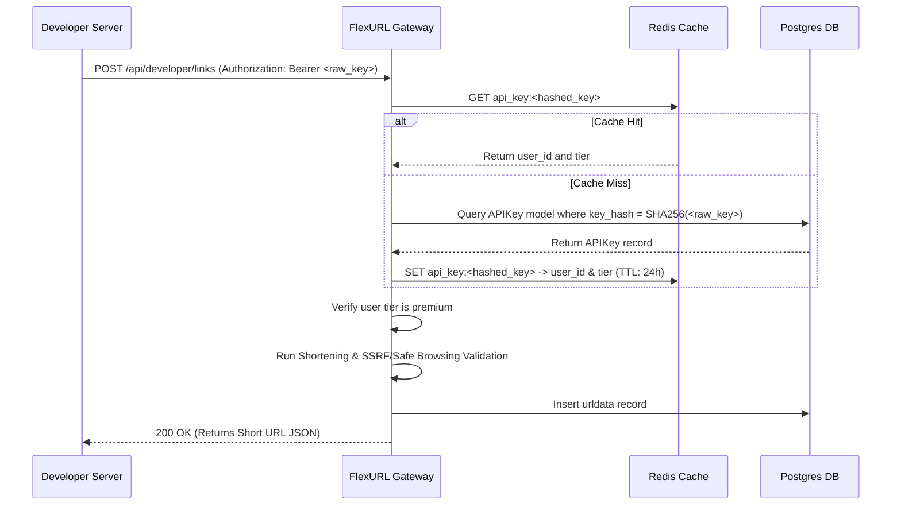

# Implementation Plan — Developer API Keys & Programmatic URL Shortening

Introduce developer integration capabilities for premium users. This plan outlines the database schemas, authentication dependencies, programmatic endpoints, rate-limiting, and frontend dashboard components required.

## Proposed Architecture



---

## 1. Backend Modifications

### Database Models

#### [NEW] [models.py](file:///D:/urlshortener/backend/models.py)
We will introduce the `ApiKey` model to store hashed credentials:
```python
from datetime import datetime, UTC
from typing import Optional
from sqlmodel import SQLModel, Field

class ApiKey(SQLModel, table=True):
    id: Optional[int] = Field(default=None, primary_key=True)
    key_hash: str = Field(index=True, nullable=False, unique=True)
    name: str = Field(max_length=255, nullable=False)
    user_id: int = Field(foreign_key="user.id", nullable=False)
    created_at: datetime = Field(default_factory=lambda: datetime.now(UTC))
    is_active: bool = Field(default=True)
```

### Authentication Dependency

#### [NEW] [dependencies.py](file:///D:/urlshortener/backend/dependencies.py) (or inside [app.py](file:///D:/urlshortener/backend/app.py))
Define a new HTTP Bearer authentication dependency:
- Extracts the token from the `Authorization: Bearer <API_KEY>` header.
- Hashes the raw token using SHA-256.
- Queries Redis first: `api_key:{hash}`. If present, deserializes `user_id` and `tier`.
- Falls back to PostgreSQL: queries `ApiKey` where `key_hash` matches.
- Verifies that the associated user belongs to a premium tier (`premium`, `startup`, or `business`).
- Returns the `user_id`.

### Developer API Endpoints

#### [NEW] [app.py](file:///D:/urlshortener/backend/app.py)
1. **Shorten Link**: `POST /api/developer/links`
   - Accepts long URL, custom alias, expiration, passwords, webhook targets, and OS-targeted redirection fields.
   - Runs standard URL validation, SSRF checks, and Google Safe Browsing verification.
   - Saves to DB and returns the shortened link metadata.
2. **Batch Shorten (Premium Optimization)**: `POST /api/developer/links/batch`
   - Allows shortening up to 50 links in a single request.
3. **List API Keys**: `GET /api/developer/keys`
   - Returns a list of active keys for the user (only showing truncated hash/names, never the raw key).
4. **Generate API Key**: `POST /api/developer/keys`
   - Generates a cryptographically secure key: `"flx_" + secrets.token_hex(24)`.
   - Hashes it and saves it.
   - Returns the raw key **once** to the client.
5. **Revoke API Key**: `DELETE /api/developer/keys/{id}`
   - Marks the key as inactive and deletes the cache key from Redis.

---

## 2. Frontend Modifications

### Dashboard Credentials Manager

#### [MODIFY] [dashboard.html](file:///D:/urlshortener/frontend/dashboard.html)
Add a new subsection inside the dashboard for **Developer Credentials**:
- **API Keys Card**: List active keys with their creation date, and include a **Generate Key** button.
- **Key Display Modal**: A one-time display modal showing the generated raw API key (advising the user to copy it safely as it won't be shown again).
- **Revoke Button**: Instantly deletes the API key.
- **Webhook Endpoint**: Shows the webhook target configuration.

---

## 3. Recommended Developer Safety Features

### Developer Rate Limiting
- Keyed by `APIKey`.
- Rates:
  - Premium Tier: 60 requests/minute.
  - Startup Tier: 180 requests/minute.
  - Business Tier: 600 requests/minute.
- Handled via Redis token buckets.

### Allowed Origins restriction (CORS protection)
- Optional field on `ApiKey` to restrict client-side API requests to specific origin domains (CORS whitelist).

---

## Verification Plan

### Automated Tests
- Create unit tests simulating API key validation:
  - Valid key -> returns `200 OK`.
  - Revoked key -> returns `401 Unauthorized`.
  - Non-premium user key -> returns `403 Forbidden`.
  - Valid payload shortening -> returns created link.
  - SSRF/Malicious URL payload -> returns `400 Bad Request`.
  - Concurrency rate limit test.

### Manual Verification
- Generate an API key from the dashboard interface.
- Copy it and run a local `curl` test from a terminal.
- Verify the link compiles correctly and redirects.
